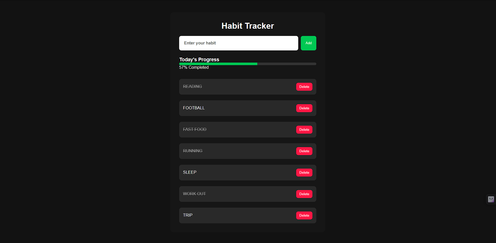

# Habit Tracker

A simple and responsive **Habit Tracker Web Application** built using **HTML, CSS, and JavaScript**.  
This app helps users create daily habits, track completion, and monitor daily progress.

## Features

- Add new habits
- Mark habits as completed
- Dynamic daily progress tracker
- LocalStorage support (data saved after refresh)
- Delete habits
- Automatic daily reset tracking
- Responsive and clean UI
- Uppercase habit display

## Technologies Used

- HTML5
- CSS3
- JavaScript
- LocalStorage API

## Screenshot



## Live Demo
live link : https://abhijith-e0.github.io/habit-tracker/

```bash
## Project Structure
Habit-Tracker/
│
├── images/
|     └── screenshot1.png
├── index.html
├── style.css
└── script.js
```

## How It Works

1. Enter a habit name in the input field
2. Click the **Add** button
3. Click on a habit to mark it as completed
4. The progress bar updates automatically
5. Completed habits are stored for the current day
6. Data remains saved using LocalStorage


